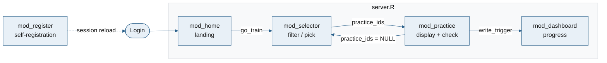

# CLAUDE.md

This file provides guidance to Claude Code (claude.ai/code) when working with code in this repository.

---

## What this project is

**shinytigeR** (Training mit individuell generierten Erfolgsrückmeldungen in R) is a Shiny web app for Goethe University psychology students to practice statistics and R. Students log in, filter and select multiple-choice practice items, answer them, receive immediate automated feedback, and track their progress via an IRT-based competency dashboard.

The app is structured as an **R package** (`shinytigeR`) with the Shiny app living in `inst/app/`. It is deployed via Docker on ShinyProxy.

---

## Commands

```bash
# Run locally (from project root) — uses the rv-managed library, loads the
# package via pkgload::load_all(), starts at http://localhost:7331
rv run dev/run.R
```

```r
# shiny::runApp("inst/app") on its own is NOT equivalent to the above — inst/app/app.R
# just does library(shinytigeR), which fails (or silently resolves resource paths wrong)
# unless the package is already installed/loaded in that R session. Use rv run dev/run.R,
# or install the package first and call:
shinytigeR::run_app()

# Document (regenerate NAMESPACE and man/)
devtools::document()

# Check the package
devtools::check(vignettes = FALSE)

# Build tarball + Dockerfile for deployment (run from project root)
Rscript deploy/build.R
# Then:
docker build --platform linux/amd64 -t shinytiger deploy/
```

For full local setup instructions (native macOS/Linux via `rv`, or a Docker-based dev environment), see `SETUP.md`. Note `docker/Dockerfile.dev` is dev-only (live source + package library, no production tarball) — distinct from `deploy/Dockerfile`, which builds the ShinyProxy production image.

### Dependency management (rv)

Dependencies are managed with [`rv`](https://github.com/A2-ai/rv), a Rust-based R package manager. Config is in `rproject.toml`; the resolved lock is in `rv.lock`.

```bash
rv sync        # install/update packages to match rv.lock
rv add <pkg>   # add a package and update rv.lock
rv remove <pkg>
rv run dev/run.R                # run with the rv-managed library on PATH
```

Do **not** edit `rv.lock` by hand. The `rv/` directory is the local package library (arm64/macOS dev); it is gitignored and not part of the built package.

### Testing

```r
devtools::test()          # run the full testthat suite
devtools::test_active_file()  # run just the currently open test file
```

`tests/testthat/` (1400+ lines) covers `irt.R`, `db.R`, `utils.R`, the dashboard helpers, registration (`db_register_user`/`db_username_exists`/`REG_*` constants), and module reactivity for `mod_selector`, `mod_practice`, and `mod_dashboard` via `shiny::testServer()`.

**`tests/testthat/helper-modules.R`** has reusable fixtures for `testServer()`-based module tests — check here before writing ad hoc test setup:
- `make_data_item()` — minimal 6-row item `data.frame` (2 areas × content/coding/content, IRT params set)
- `fake_credentials(user)` — a logged-in `credentials()` reactive
- `selector_cell_inputs(area_vals, type_vals, n_items, only_new)` — builds the `cell_i_j` input list `mod_selector_server` expects
- `make_user_db(user, item_ids, correct, areas)` — writes a temp SQLite user DB pre-populated with response rows, returns its path

---

## Project structure

```
app_v3/
├── DESCRIPTION            # package metadata; Imports lists all R dependencies
├── NAMESPACE              # auto-generated by devtools::document() — do not edit
├── .Rbuildignore          # excludes rv/, deploy/, app.R, *.sqlite from tarball
├── rproject.toml          # rv dependency config (repositories + top-level deps)
├── rv.lock                # full resolved dependency tree (auto-generated by rv)
│
├── R/                     # Package R source — all functions exported or internal
│   ├── run_app.R          # run_app() — the intended entry point (NAMESPACE also exports app_server/app_ui, mainly for testing/advanced use)
│   ├── shinytigeR-package.R  # package-level imports + globalVariables()
│   ├── constants.R        # app-wide constants (see below)
│   ├── db.R               # all SQLite access functions
│   ├── irt.R              # IRT model (2PL) functions
│   ├── utils.R            # markdown/math rendering + answer helpers
│   ├── ui.R               # app_ui() — top-level page_navbar layout
│   ├── server.R           # app_server() — wires auth + all modules
│   ├── mod_home.R         # module: home/landing panel (post-login)
│   ├── mod_register.R     # module: self-registration (pre-login, semester-code gated)
│   ├── mod_selector.R     # module: item filter/selection UI
│   ├── mod_practice.R     # module: item display + answer checking
│   └── mod_dashboard.R    # module: progress dashboard
│
├── inst/app/
│   ├── app.R              # loaded by runApp(); skips library() if already loaded via load_all()
│   └── www/
│       ├── css/app.css    # all custom CSS
│       ├── img/           # logo files (tigeR_hex.png, tiger_logo_white.png, favicon.png)
│       └── img_item/      # item images referenced in the SQLite DB
│
├── deploy/
│   ├── build.R            # generates Dockerfile + builds tarball (run this, not the Dockerfile directly)
│   ├── Dockerfile         # auto-generated by build.R — do not edit by hand; production image for ShinyProxy
│   ├── rv.lock            # copied here by build.R for the Docker build context
│   ├── rproject.toml      # copied here by build.R for the Docker build context
│   └── shinytigeR_*.tar.gz  # built by build.R
│
├── docker/                # dev-only Docker environment (not for deployment — see SETUP.md)
│   ├── Dockerfile.dev     # R 4.6 + rv + libsodium-dev; source is bind-mounted, not copied
│   ├── docker-compose.yml # bind-mounts project root; rv sync runs on container start
│   └── run_dev.R          # container entrypoint — like dev/run.R but binds 0.0.0.0, no browser launch
│
├── SETUP.md               # local setup guide: native (rig + rv) or Docker
│
├── tests/testthat/        # testthat suite — see "Testing" above
│
├── docs/                  # gitignored — forward-looking research memos, not shipped code docs
│                           # (dashboard/IRT redesign literature reviews, model comparisons)
│
├── db_item.sqlite         # item pool (gitignored in production, present locally)
├── db_user.sqlite         # per-user response log (gitignored)
└── db_credentials.sqlite  # hashed passwords (gitignored)
```

---

## Architecture

### Module flow

The app has five Shiny modules wired together in `server.R`:



- **`go_train`** is a plain callback function passed to `mod_home`. When the "Jetzt üben" button is clicked it calls `bslib::nav_select()` using the app-level session (captured in `server.R` via closure) to navigate to the train panel.
- **`practice_ids`** (`reactiveVal(NULL)`) is the only piece of shared cross-module state. `NULL` means show the selector; an integer vector of item IDs means show the practice module. It lives in `server.R` and is passed by reference to both `mod_selector` and `mod_practice`.
- **`write_trigger`** (`reactiveVal(0L)`) is incremented by `mod_practice` after every confirmed DB write. `mod_dashboard` uses it to invalidate its user-data cache without being directly coupled to the practice module.

### Authentication pattern

All modules are registered **inside** an `observeEvent(credentials()$user_auth, {...})` block in `server.R`. This means modules only activate after a successful login. Navbar tabs for protected panels are hidden via CSS on startup and revealed with `shinyjs::show()` post-login.

`mod_register_server` is the one exception — it's registered **before** the auth gate (self-registration has to work for users who don't have credentials yet). Its UI (`mod_register_ui`) sits in the login panel alongside the login form; `input$show_register`/`input$show_login` toggle between them via `shinyjs::runjs()` in `server.R` (`toggle_login_register()`), not `bslib::nav_select()` — this is a same-panel show/hide, not a tab switch. See `R/mod_register.R` below.

### Train panel view switching

The train panel renders either the selector or the practice UI dynamically:

```r
output$train_view <- renderUI({
  if (is.null(practice_ids())) mod_selector_ui("selector_1")
  else                          mod_practice_ui("practice_1")
})
```

Both module **servers** are registered once at login time and remain active; only the UI toggles.

---

## Key files in detail

### `R/constants.R`

Single source of truth for:

| Constant | Type | Purpose |
|---|---|---|
| `LEARNING_AREA_LEVELS` | `character` vector | Canonical ordering of the 7 topic areas; used as factor levels throughout |
| `LEARNING_AREA_LABELS` | named `character` | Short display names → full DB values (e.g. `"Inferenz" = "Grundlagen der Inferenzstatistik"`) |
| `ITEM_TYPE_LABELS` | named `character` | `"Inhaltlich" = "content"`, `"R-Code" = "coding"` — these must match `type_item` values in `db_item.sqlite` |
| `PRIMARY_COLOR` | `character` | `"#285f8a"` (Goethe blue) — used in theme and CSS variables |
| `ANSWER_COLORS` | named list | Hex colors for correct/incorrect/skip states |
| `DB_ITEMS()` / `DB_USERS()` / `DB_CREDS()` | functions | Return full paths to the three SQLite files; read `TIGER_DB_DIR` env var (default `"."`) |
| `CONTACT_EMAIL` | `character` | Shown in error messages (e.g. registration unavailable) and on the home panel |
| `REG_USERNAME_PATTERN` / `REG_PW_MIN_LENGTH` / `REG_MAX_ATTEMPTS` / `REG_ATTEMPT_DELAY_S` | validation constants | Used by `mod_register.R` — see that section below |

> **Important:** `ITEM_TYPE_LABELS` values (`"content"`, `"coding"`) must exactly match the `type_item` column in `db_item.sqlite`. If item types change in the DB, update this constant.

> **Registration requires `TIGER_REG_CODE`** (a separate env var from the constants above, read directly via `Sys.getenv()` in `mod_register.R`, not defined in `constants.R`) — the shared semester code students must enter to self-register. Unset in local dev by default, so registration will show "derzeit nicht verfügbar" unless you export it.

### `R/db.R`

All database access. Uses a simple open/close pattern (`db_with()`) — no connection pooling.

| Function | Description |
|---|---|
| `db_with(path, fn, wal=FALSE)` | Opens a DBI connection, runs `fn(con)`, closes on exit. Set `wal=TRUE` for write operations |
| `db_get_items()` | Reads the full item pool from `db_item.sqlite`. Rewrites image paths: `"www/foo.png"` → `"img_item/foo.png"` to match Shiny's resource paths |
| `db_get_userdata(user_id)` | Returns all response rows for a user, or an empty `data.frame` if none |
| `db_user_exists(user_id)` | Returns `TRUE` if the user has any recorded responses |
| `db_write_response(user_id, df)` | Appends one response row; creates the user table if it doesn't exist yet |
| `db_get_credentials()` | Returns the credentials table for `shinyauthr` |
| `db_username_exists(username)` | `TRUE`/`FALSE`; case-sensitive. Used by `mod_register.R` |
| `db_register_user(username, password_plain)` | Inserts a new row into `credentials_db` inside a `BEGIN IMMEDIATE` transaction (dupe-check + insert are atomic); hashes with `sodium::password_store()`; `stop("username_taken")` if the username exists |

**DB path resolution:** All functions default to `DB_ITEMS()` / `DB_USERS()` / `DB_CREDS()` which read `TIGER_DB_DIR` from the environment. Locally this defaults to `"."` (project root). In Docker it is set to `/opt/shinyapp` (the mounted volume).

### `R/irt.R`

Two-parameter logistic (2PL) IRT model for estimating student ability.

| Function | Description |
|---|---|
| `prob_2pl(theta, a, b)` | Item response probability: `1 / (1 + exp(-a*(theta-b)))` |
| `estimate_theta(responses, a, b)` | MLE via L-BFGS-B (`optim`), bounded to `[-3, 3]`. Returns `NA` on error |
| `estimate_competency(responses, items)` | Runs `estimate_theta` per learning area using **first attempts only**. Returns a `data.frame` with columns `learning_area`, `theta`, `n_items` |

Parameters `a` (discrimination) and `b` (difficulty) come from `irt_discr` and `irt_diff` columns in `db_item.sqlite`. Items with missing IRT parameters are silently excluded from estimation.

### `R/utils.R`

#### Math/LaTeX rendering

Items and feedback can contain LaTeX math delimited by `$...$` (inline) or `$$...$$` (display). The rendering pipeline:

1. **`protect_math_delimiters(text)`** — pre-processes text before passing to `markdownToHTML`:
   - Protects inline code spans (`` `...` ``) from math detection
   - Escapes `*` and `_` inside math regions (prevents `<em>` injection by commonmark)
   - Converts `$$...$$` → `\\[...\\]` and `$...$` → `\\(...\\)` (double backslashes because commonmark strips one layer during the markdown pass)
2. **`render_md(text)`** — calls `protect_math_delimiters` then `markdown::markdownToHTML(fragment.only=TRUE)`
3. MathJax is loaded via `shiny::withMathJax()` in the practice module UI, with a manual re-typeset trigger `MathJax.Hub.Queue(['Typeset', MathJax.Hub])` injected as an inline `<script>` inside each `renderUI` output.

#### Other helpers

| Function | Description |
|---|---|
| `get_answeroptions(item)` | Extracts non-NA values from `answeroption_01`…`answeroption_06` |
| `get_feedbackoptions(item)` | Extracts non-NA values from `if_answeroption_01`…`if_answeroption_06` |
| `evaluate_answer(item, answer_idx)` | Returns `"correct"`, `"incorrect"`, or `"skip"` (last option is always the skip option) |
| `build_response_row(item, answer_idx, user_id, session_token)` | Constructs the `data.frame` row written to `db_user.sqlite` |
| `safe_sample(x, size)` | `sample()` that handles `length(x) < size` gracefully |
| `is_img_path(x)` | Returns `TRUE` for strings ending in `.png/.jpg/.jpeg/.svg/.gif` |

### `R/mod_home.R`

Landing panel shown immediately after login. Displays a personalised greeting, a three-step "how it works" explanation, pool stats, and links to pandar dataset documentation, otter (R practice), and the contact email. The "Jetzt üben" button calls the `go_train` callback passed from `server.R`, which uses `bslib::nav_select()` with the **app-level session** (not the module session) to switch tabs. If you need to add cross-tab navigation from a module, always capture `session` in `server.R` and pass it via closure — `bslib::nav_select()` uses `getDefaultReactiveDomain()` which resolves to the module session inside a module server.

### `R/mod_register.R`

Self-registration form on the login panel, gated by a shared **semester code** (`Sys.getenv("TIGER_REG_CODE")` — must be set in the deployment environment; if unset, registration shows an error telling the student to contact `CONTACT_EMAIL` instead of silently failing). Validates, in order: all fields non-empty → username matches `REG_USERNAME_PATTERN` (`constants.R`, 3–30 alphanumeric/`._-`) → password ≥ `REG_PW_MIN_LENGTH` chars → passwords match → semester code matches. On success, `db_register_user()` inserts into `credentials_db` (rejecting duplicate usernames with a `"username_taken"` condition, which is deliberately **not** counted toward the attempt lockout below — a taken username isn't a guessing attempt) and reloads the session so `shinyauthr::loginServer()` picks up the new row.

**Brute-force mitigation**, entirely in-module `reactiveVal`s (`attempts`, `locked`), not persisted:
- A fixed `Sys.sleep(REG_ATTEMPT_DELAY_S)` on every submit attempt (rate limiting)
- After `REG_MAX_ATTEMPTS` failed semester-code guesses (or non-`username_taken` DB errors), the form locks until the page is reloaded

### `R/mod_selector.R`

Renders a **checkbox matrix** (rows = item types, columns = learning areas) built from plain `tags$input`/`tags$label` HTML — not `checkboxInput()` — so the layout is fully controlled via CSS (`.sel-matrix`, `.sel-cb`, `.sel-col-label`, `.sel-row-label`). Row headers and column headers act as select-all toggles for their row/column; a corner checkbox selects all. The reactivity is flat: cell checkboxes → `selected_combos()` → `filtered_items()` → `avail_info` output + submit handler. No `reactiveValues` bool matrix; each cell is read directly via `input[[paste0("cell_", i, "_", j)]]`.

### `R/mod_practice.R`

The practice module has two separate `renderUI` outputs to avoid unnecessary re-renders:

- **`output$item_stimulus`** — only invalidates when `current_item()` changes (i.e., when moving to a new item). Never re-renders on check.
- **`output$item_answers`** — invalidates on both item change and check. Renders interactive radio inputs before check; disabled result-colored inputs + feedback card after check.

**Answer coloring** is done via CSS classes on the radio `<input>`:
- `.radio-result-correct`, `.radio-result-incorrect`, `.radio-result-skip` — defined in `app.css`
- The last answer option is always the skip option (equal to `length(get_answeroptions(item))`)

**State** is managed by a `reactiveValues` object inside the module:
```r
state <- reactiveValues(pos=1L, checked=FALSE, answer_id=NULL)
```
`pos` is the index into `practice_ids()`. Moving to the next item increments `pos`; finishing all items sets `practice_ids(NULL)` to return to the selector.

### `R/mod_dashboard.R`

Reactive dependency chain:
```
write_trigger → user_data → first_attempts → competency
```
`first_attempts` de-duplicates by `(user_id, item_id)` — only the first attempt per item feeds the IRT model. All descriptive stats (accuracy %, days practiced, etc.) use `user_data` (all attempts).

**Competency labels** (mapped from θ):

| θ range | Label | Color scheme |
|---|---|---|
| θ > 1.0 | Stark | Blue-teal |
| 0 < θ ≤ 1.0 | Gut entwickelt | Green |
| -0.5 < θ ≤ 0 | Entwickelt sich | Yellow |
| θ ≤ -0.5 | Übungsbedarf | Red/Pink |
| No data | Keine Daten | Gray |

**Evidence strength** (from unique item count per area):

| Unique items | Label | Dots |
|---|---|---|
| ≥ 8 | Hoch | ●●● |
| 3–7 | Mittel | ●●○ |
| 1–2 | Niedrig | ●○○ |
| 0 | — | ○○○ |

**Recommendations** are computed by `recommend_next()`: areas with no data rank first (priority 10), then low-evidence areas (priority 20), then low-θ areas (priority 30+, scaled by `-θ`). The top 3 are shown.

---

## Databases

Three SQLite files, location controlled by the `TIGER_DB_DIR` environment variable:

### `db_item.sqlite` — item pool (read-only at runtime)

Table: `item_db`

| Column | Type | Description |
|---|---|---|
| `id_item` | integer | Primary key |
| `learning_area` | text | Must be one of `LEARNING_AREA_LEVELS` |
| `type_item` | text | `"content"` or `"coding"` |
| `bloom_taxonomy` | text | `"knowledge"`, `"comprehension"`, or `"application"` |
| `stimulus_text` | text | Markdown + LaTeX preamble (nullable) |
| `stimulus_image` | text | Path like `www/img_item/foo.png` (stripped to `img_item/foo.png` at load) |
| `answeroption_01`…`answeroption_06` | text | Answer choices; last non-NA is always "Überspringen" |
| `if_answeroption_01`…`if_answeroption_06` | text | Per-answer feedback text (Markdown + LaTeX) |
| `answer_correct` | integer | 1-based index of the correct answer |
| `type_answer` | text | `"text"` or `"image"` |
| `irt_discr` | real | IRT discrimination parameter *a* |
| `irt_diff` | real | IRT difficulty parameter *b* |

### `db_user.sqlite` — response log (read-write at runtime)

One table per user, named by `id_user`. Each row is one response:

| Column | Type | Description |
|---|---|---|
| `id_user` | text | Username |
| `id_session` | text | Shiny session token |
| `id_date` | integer | `as.integer(Sys.Date())` |
| `id_datetime` | integer | `as.integer(Sys.time())` — used for ordering |
| `id_item` | integer | Foreign key to `db_item.sqlite` |
| `learning_area` | text | Denormalized from item (for fast dashboard queries) |
| `selected_option` | integer | 1-based index of chosen answer |
| `answer_correct` | integer | Correct answer index (denormalized) |
| `bool_correct` | logical | `TRUE`/`FALSE`/`NA` (NA = skipped) |
| `skipped` | logical | `TRUE` if last option was selected |

### `db_credentials.sqlite` — authentication

Table: `credentials_db` — columns `user_name` and `password_hashed` (sodium-hashed). Managed outside the app; passed to `shinyauthr::loginServer()`.

---

## UI conventions

### CSS (`inst/app/www/css/app.css`)

Key CSS variables (defined on `:root`):
- `--tiger-primary: #285f8a`
- `--tiger-correct: #00618f`
- `--tiger-incorrect: #D81B60`
- `--tiger-skip: #FFA000`
- `--anim-dur: 0.35s`

Key CSS classes to be aware of when changing layout:

| Class | Purpose |
|---|---|
| `.main-content` | Centers practice/selector/home content, `max-width: 1400px` |
| `.dashboard-wrap` | Full-width dashboard container, `padding: 0 2rem 2rem` |
| `.login-page` / `.login-card` / `.login-card-header` / `.login-card-body` | Login page layout |
| `.reg-error` / `.reg-success` | Registration feedback message styling (`mod_register.R`'s `reg_msg()`) |
| `.home-steps` / `.home-step` / `.home-step-num` | Home panel numbered steps layout |
| `.sel-matrix` / `.sel-cb` / `.sel-col-label` / `.sel-row-label` | Checkbox matrix in selector |
| `.sel-options-row` | Flex row containing number input, avail info, and toggle |
| `.practice-answers-section` | Gray tinted answers area below stimulus in practice card |
| `.answer-option` | Per-answer radio row; hover suppressed post-check via `:has(input:disabled)` |
| `.radio-result-correct/incorrect/skip` | Post-check radio fill color (requires `!important`) |
| `.feedback-card` | Per-answer feedback block with colored left border and shadow |
| `.practice-stat` / `.practice-stat-val` / `.practice-stat-lbl` | Dashboard practice behaviour grid cells |
| `.dashboard-comp-table` | Competency map table in dashboard |
| `.rec-num` | Circular number badge in recommendations card |

### Resource paths

Static files are served via Shiny's **built-in `www/` auto-serving convention** — `inst/app/www/<subdir>/*` is automatically available at `/<subdir>/*` for any app directory Shiny runs (`shiny::runApp("inst/app")` in dev, or the installed package dir via `run_app()`), with zero configuration:

| Prefix | Filesystem location | Content |
|---|---|---|
| `img` | `inst/app/www/img/` | App logos and favicon |
| `img_item` | `inst/app/www/img_item/` | Item stimulus and answer images |
| `css` | `inst/app/www/css/` | `app.css` |

`inst/app/app.R` previously called `shiny::addResourcePath()` with `system.file(...)` to register these explicitly — this was removed because it was both redundant with the built-in convention *and* fragile: `system.file()` only resolves correctly if the package is genuinely installed or `pkgload` is present (which isn't in `rv.lock`/`DESCRIPTION`), so on some setups it silently returned `""` and **overrode** the working default with a broken one, causing missing CSS/images for contributors without `pkgload` in a personal library. **Do not re-add `addResourcePath()` for these three prefixes** — the auto-serving convention already covers them and doesn't depend on how the package was loaded.

---

## Deployment

### Build process

Run once per release from the project root:

```r
Rscript deploy/build.R
```

This script:
1. Parses all package names from `rv.lock`
2. Queries the Posit PPM sysreqs API (`packagemanager.posit.co/__api__/repos/1/sysreqs`) for Ubuntu 22.04 apt packages needed by those packages
3. Generates `deploy/Dockerfile` via `{dockerfiler}` with the correct system dependencies baked in
4. Runs `devtools::document()` to regenerate `NAMESPACE`
5. Builds the `shinytigeR_*.tar.gz` tarball into `deploy/`
6. Copies `rv.lock` and `rproject.toml` into `deploy/`

Then build the image:

```bash
docker build --platform linux/amd64 -t shinytiger deploy/
```

The `--platform linux/amd64` flag is required when building on Apple Silicon; without it Docker selects `arm64` and the `x86_64` rv binary fails under Rosetta.

### Dockerfile structure (multi-stage)

**Stage 1 — builder (`rocker/r-ver:4.6`)**
- Installs apt dev headers (libsodium-dev, etc.) and build tools
- Downloads the latest `rv` binary from GitHub releases (x86_64 Linux)
- Runs `rv sync --locked` to install all R packages into the system library

**Stage 2 — runtime (`rocker/r-ver:4.6`)**
- Copies the installed R library from the builder stage (no dev headers in the final image)
- Installs the `shinytigeR` tarball with `R -e 'install.packages(...)'`
- Creates user `beitner` (uid 1002, gid 1003) for ShinyProxy
- Sets `TIGER_DB_DIR=/opt/shinyapp` — the SQLite files must be mounted at this path

### ShinyProxy

The container exposes port 3838. ShinyProxy should mount the three SQLite database files into `/opt/shinyapp/`:
- `/opt/shinyapp/db_item.sqlite`
- `/opt/shinyapp/db_user.sqlite`
- `/opt/shinyapp/db_credentials.sqlite`

ShinyProxy's app config must also set **`TIGER_REG_CODE`** (the semester code — see `R/mod_register.R` above) as a container env var. It is **not** baked into `deploy/Dockerfile` (that would ship a secret in the image); without it set at runtime, self-registration is disabled with an error pointing students to `CONTACT_EMAIL`.

The `CMD` starts the app as:
```
R -e "options(shiny.port=3838, shiny.host='0.0.0.0'); library(shinytigeR); shinytigeR::run_app()"
```

---

## Adding a new dependency

1. `rv add <package>` — updates `rproject.toml` and `rv.lock`
2. Add the package to `Imports:` in `DESCRIPTION`
3. Add `@importFrom pkg fn` to `R/shinytigeR-package.R` (or use `pkg::fn()` in code)
4. Run `devtools::document()` to update `NAMESPACE`
5. Run `Rscript deploy/build.R` — the sysreqs API will automatically detect any new system dependencies

## Adding a new item type or learning area

- **New learning area:** Add the full name to `LEARNING_AREA_LEVELS` and a short label to `LEARNING_AREA_LABELS` in `constants.R`. Order matters — it controls display order everywhere.
- **New item type:** Add to `ITEM_TYPE_LABELS` in `constants.R`. The value must exactly match the `type_item` value stored in `db_item.sqlite`.
- **New Bloom level:** Add handling in `mod_dashboard.R` in the `bloom_lvls` vector and the `lbl` switch statement.

## Adding a new module

1. Create `R/mod_<name>.R` with `mod_<name>_ui(id)` and `mod_<name>_server(id, ...)` following the existing module pattern
2. Add the UI call to `R/ui.R` (new `nav_panel`) or to the `renderUI` in `server.R`
3. Register the server inside the `observeEvent(credentials()$user_auth, {...})` block in `server.R`
4. If the module needs to know when the DB was written, accept `write_trigger` as a parameter
