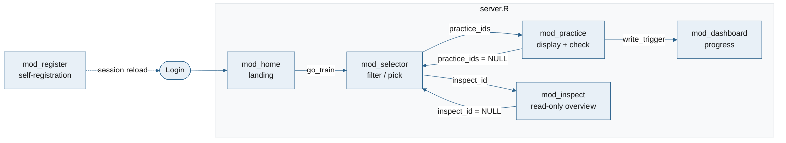

# CLAUDE.md

This file provides guidance to Claude Code (claude.ai/code) when working with code in this repository.

---

## What this project is

**shinytigeR** (Training mit individuell generierten Erfolgsrückmeldungen in R) is a Shiny web app for Goethe University psychology students to practice statistics and R. Students log in, filter and select multiple-choice practice items, answer them, receive immediate automated feedback, and track their progress via an IRT-based competency dashboard.

The app is structured as an **R package** (`shinytigeR`) with the Shiny app living in `inst/app/`. It is deployed via Docker on ShinyProxy.

---

## Commands

**For full local setup (installing R/`rv`/`libsodium`, or the Docker-based alternative), see `SETUP.md` — it's the authoritative onboarding doc.** The commands below assume that setup is already done.

```bash
# Run locally (from project root) — uses the rv-managed library, loads the
# package via pkgload::load_all(), starts at http://localhost:7331
rv run dev/run.R
```

```r

# or install the package first and call:
shinytigeR::run_app()

# Document (regenerate NAMESPACE and man/) — needs devtools or roxygen2,
# neither of which is in rproject.toml (see Testing below for why); install
# one separately (e.g. in a personal, non-rv-managed library) to run this
devtools::document()

# Check the package — same caveat as above
devtools::check(vignettes = FALSE)

# Build tarball + Dockerfile for deployment (run from project root)
Rscript deploy/build.R
# Then:
docker build --platform linux/amd64 -t shinytiger deploy/
```

Note `docker/Dockerfile.dev` (used by `SETUP.md`'s Docker option) is dev-only (live source + package library, no production tarball) — distinct from `deploy/Dockerfile`, which builds the ShinyProxy production image described under Deployment below.

### Dependency management (rv)

Dependencies are managed with [`rv`](https://github.com/A2-ai/rv), a Rust-based R package manager. Config is in `rproject.toml`; the resolved lock is in `rv.lock`.

```bash
rv sync        # install/update packages to match rv.lock
rv add <pkg>   # add a package and update rv.lock
rv remove <pkg>
rv run dev/run.R                # run with the rv-managed library on PATH
```

Do **not** edit `rv.lock` by hand. The `rv/` directory is the local package library (arm64/macOS dev); it is gitignored and not part of the built package.

### Testing

`testthat`, `withr`, and `pkgload` are in `rproject.toml` (all three are already declared in `DESCRIPTION`'s `Suggests:`, and `pkgload` is what `dev/run.R` uses to load the package). `devtools` deliberately is **not** — a dry run showed it pulls in ~25 extra packages (`roxygen2`, `rmarkdown`, `tinytex`, `usethis`, `rcmdcheck`, `stringi`, `ragg`/`systemfonts`, the `gert`/`credentials` git stack, …) and would even force a different `rlang` version, which risks shifting versions the app itself depends on. `testthat` + `withr` + `pkgload` alone add only 14 light packages with no new system dependencies (`fs` is the only sysreqs hit, and it's already pulled in by `shiny`/`bslib`).

Run the suite via `rv run`, which uses the rv-managed library regardless of what (if anything) is in a personal R library:

```bash
rv run -e 'pkgload::load_all(quiet = TRUE); testthat::test_dir("tests/testthat")'
```

If you have `devtools` available separately (e.g. in a personal, non-rv-managed library — not through `rv run`), `devtools::test()` / `devtools::test_active_file()` work the same way and are more convenient for iterating on a single file.

`tests/testthat/` (1400+ lines) covers `irt.R`, `db.R`, `utils.R`, the dashboard helpers, registration (`db_register_user`/`db_username_exists`/`REG_*` constants), and module reactivity for `mod_selector`, `mod_practice`, and `mod_dashboard` via `shiny::testServer()`. `test-server.R` is the one exception that tests `app_server` itself end-to-end (`shiny::testServer(app_server, {...})`) rather than a single module — reserve that pattern for bugs that specifically span the `server.R` wiring layer between modules, like the one documented in `R/mod_dashboard.R`'s "Bug, hit and fixed once" callout below.

**`tests/testthat/helper-modules.R`** has reusable fixtures for `testServer()`-based module tests — check here before writing ad hoc test setup:
- `make_data_item()` — minimal 6-row item `data.frame` (2 areas × content/coding/content, IRT params set)
- `fake_credentials(user)` — a logged-in `credentials()` reactive
- `selector_cell_inputs(area_vals, type_vals, n_items, only_new)` — builds the `cell_i_j` input list `mod_selector_server` expects
- `make_user_db(user, item_ids, correct, areas)` — writes a temp SQLite user DB pre-populated with response rows, returns its path
- `make_ability_db(user, computed_at, theta, n_items)` — writes a temp SQLite ability DB pre-populated with one saved snapshot (one row per learning area), returns its path

> **Known gap:** `mod_inspect.R` (read-only item-overview module) and the direct-ID-lookup addition to `mod_selector.R` were added after this suite was last updated and have **no `testthat` coverage yet** — only ad hoc verification during development. If you touch either, add `test_that()` cases to `test-modules.R` following the existing `mod_selector`/`mod_practice` pattern rather than leaving it untested.

---

## Project structure

```
app_v3/
├── DESCRIPTION            # package metadata; Imports lists all R dependencies
├── NAMESPACE              # auto-generated by devtools::document() — do not edit
├── .Rbuildignore          # excludes rv/, deploy/, app.R, *.sqlite from tarball
├── rproject.toml          # rv dependency config (repositories + top-level deps)
├── rv.lock                # full resolved dependency tree (auto-generated by rv)
│
├── R/                     # Package R source — all functions exported or internal
│   ├── run_app.R          # run_app() — the intended entry point (NAMESPACE also exports app_server/app_ui, mainly for testing/advanced use)
│   ├── shinytigeR-package.R  # package-level imports + globalVariables()
│   ├── constants.R        # app-wide constants (see below)
│   ├── db.R               # all SQLite access functions
│   ├── irt.R              # IRT model (2PL) functions
│   ├── utils.R            # markdown/math rendering + answer helpers
│   ├── ui.R               # app_ui() — top-level page_navbar layout
│   ├── server.R           # app_server() — wires auth + all modules
│   ├── mod_home.R         # module: home/landing panel (post-login)
│   ├── mod_register.R     # module: self-registration (pre-login, semester-code gated)
│   ├── mod_selector.R     # module: item filter/selection UI
│   ├── mod_practice.R     # module: item display + answer checking
│   ├── mod_inspect.R      # module: read-only item overview (direct ID lookup)
│   └── mod_dashboard.R    # module: progress dashboard
│
├── inst/app/
│   ├── app.R              # loaded by runApp(); skips library() if already loaded via load_all()
│   └── www/
│       ├── css/app.css    # all custom CSS
│       ├── img_app/       # app branding: logo files (tigeR_hex.png, tiger_logo_white.png, favicon.png)
│       └── img_item/      # item content images — path baked into db_item.sqlite; do not rename without migrating
│
├── deploy/
│   ├── build.R            # generates Dockerfile + builds tarball (run this, not the Dockerfile directly)
│   ├── Dockerfile         # auto-generated by build.R — do not edit by hand; production image for ShinyProxy
│   ├── rv.lock            # copied here by build.R for the Docker build context
│   ├── rproject.toml      # copied here by build.R for the Docker build context
│   └── shinytigeR_*.tar.gz  # built by build.R
│
├── docker/                # dev-only Docker environment (not for deployment — see SETUP.md)
│   ├── Dockerfile.dev     # R 4.6 + rv + libsodium-dev; source is bind-mounted, not copied
│   ├── docker-compose.yml # bind-mounts project root; rv sync runs on container start
│   └── run_dev.R          # container entrypoint — like dev/run.R but binds 0.0.0.0, no browser launch
│
├── SETUP.md               # local setup guide: native (rig + rv) or Docker
│
├── tests/testthat/        # testthat suite — see "Testing" above
│
├── docs/                  # gitignored — forward-looking research memos, not shipped code docs
│                           # (dashboard/IRT redesign literature reviews, model comparisons)
│
├── db_item.sqlite         # item pool (gitignored in production, present locally)
├── db_user.sqlite         # per-user response log (gitignored)
├── db_ability.sqlite      # persisted per-user ability (theta) snapshots (gitignored)
└── db_credentials.sqlite  # hashed passwords (gitignored)
```

---

## Architecture

### Module flow

The app has five Shiny modules wired together in `server.R`:



- **`go_train`** is a plain callback function passed to `mod_home`. When the "Jetzt üben" button is clicked it calls `bslib::nav_select()` using the app-level session (captured in `server.R` via closure) to navigate to the train panel.
- **`practice_ids`** (`reactiveVal(NULL)`) drives the selector ↔ practice toggle. `NULL` means show the selector; an integer vector of item IDs means show the practice module. It lives in `server.R` and is passed by reference to both `mod_selector` and `mod_practice`.
- **`inspect_id`** (`reactiveVal(NULL)`) is set when a student looks up a single item by ID in the selector (see `R/mod_selector.R` below). It routes to `mod_inspect` — a read-only overview — instead of the practice queue, and takes priority over `practice_ids` in the train-view switch. It never triggers a DB write.
- **`write_trigger`** (`reactiveVal(0L)`) is incremented by `mod_practice` after every confirmed DB write. `mod_dashboard` uses it to invalidate its user-data cache without being directly coupled to the practice module. `mod_inspect` never touches it, since it never writes.
- **`ability_computed_this_session`** (`reactiveVal(FALSE)`) latches `TRUE` once a fresh ability (θ) estimate has been computed and persisted to `db_ability.sqlite` during the current login — either by the silent auto-check that runs once right after login, or by `mod_dashboard`'s refresh button. It's declared in `server.R` alongside `write_trigger` and passed to `mod_dashboard_server`; see `R/mod_dashboard.R` below for why it exists (θ shouldn't be recomputed more than once per sitting).

### Authentication pattern

All modules are registered **inside** an `observeEvent(credentials()$user_auth, {...})` block in `server.R`. This means modules only activate after a successful login. Navbar tabs for protected panels are hidden via CSS on startup and revealed with `shinyjs::show()` post-login.

`mod_register_server` is the one exception — it's registered **before** the auth gate (self-registration has to work for users who don't have credentials yet). Its UI (`mod_register_ui`) sits in the login panel alongside the login form; `input$show_register`/`input$show_login` toggle between them via `shinyjs::runjs()` in `server.R` (`toggle_login_register()`), not `bslib::nav_select()` — this is a same-panel show/hide, not a tab switch. See `R/mod_register.R` below.

### Train panel view switching

The train panel renders the selector, practice, or inspect UI dynamically. `inspect_id` takes priority — if a student has looked up an item by ID, that overview shows even if a practice queue also happens to be set:

```r
output$train_view <- renderUI({
  if (!is.null(inspect_id()))  mod_inspect_ui("inspect_1")
  else if (is.null(practice_ids())) mod_selector_ui("selector_1", data_item)
  else                               mod_practice_ui("practice_1")
})
```

All three module **servers** are registered once at login time and remain active; only the UI toggles.

---

## Key files in detail

### `R/constants.R`

Single source of truth for:

| Constant | Type | Purpose |
|---|---|---|
| `LEARNING_AREA_LEVELS` | `character` vector | Canonical ordering of the 7 topic areas; used as factor levels throughout |
| `LEARNING_AREA_LABELS` | named `character` | Short display names → full DB values (e.g. `"Inferenz" = "Grundlagen der Inferenzstatistik"`) |
| `ITEM_TYPE_LABELS` | named `character` | `"Inhaltlich" = "content"`, `"R-Code" = "coding"` — these must match `type_item` values in `db_item.sqlite` |
| `PRIMARY_COLOR` | `character` | `"#285f8a"` (Goethe blue) — used in theme and CSS variables |
| `ANSWER_COLORS` | named list | Hex colors for correct/incorrect/skip states |
| `LEARNING_AREA_COLORS` | `character` vector | 7-color palette (matching `LEARNING_AREA_LEVELS` order) for the interactive ability-trajectory chart, derived from the official Goethe University 5-color palette — see `R/mod_dashboard.R` below |
| `DB_ITEMS()` / `DB_USERS()` / `DB_CREDS()` / `DB_ABILITY()` | functions | Return full paths to the four SQLite files; read `TIGER_DB_DIR` env var (default `"."`) |
| `CONTACT_EMAIL` | `character` | Shown in error messages (e.g. registration unavailable) and on the home panel |
| `REG_USERNAME_PATTERN` / `REG_PW_MIN_LENGTH` / `REG_MAX_ATTEMPTS` / `REG_ATTEMPT_DELAY_S` | validation constants | Used by `mod_register.R` — see that section below |

> **Important:** `ITEM_TYPE_LABELS` values (`"content"`, `"coding"`) must exactly match the `type_item` column in `db_item.sqlite`. If item types change in the DB, update this constant.

> **Registration requires `TIGER_REG_CODE`** (a separate env var from the constants above, read directly via `Sys.getenv()` in `mod_register.R`, not defined in `constants.R`) — the shared semester code students must enter to self-register. Unset in local dev by default, so registration will show "derzeit nicht verfügbar" unless you export it.

### `R/db.R`

All database access. Uses a simple open/close pattern (`db_with()`) — no connection pooling.

| Function | Description |
|---|---|
| `db_with(path, fn, wal=FALSE)` | Opens a DBI connection, runs `fn(con)`, closes on exit. Set `wal=TRUE` for write operations |
| `db_get_items()` | Reads the full item pool from `db_item.sqlite`. Rewrites image paths: `"www/foo.png"` → `"img_item/foo.png"` to match Shiny's resource paths |
| `db_get_userdata(user_id)` | Returns all response rows for a user, or an empty `data.frame` if none |
| `db_user_exists(user_id)` | Returns `TRUE` if the user has any recorded responses |
| `db_write_response(user_id, df)` | Appends one response row; creates the user table if it doesn't exist yet |
| `db_get_ability(user_id)` | Returns all saved ability (θ) snapshot rows for a user from `db_ability.sqlite`, or an empty `data.frame` if none |
| `db_write_ability(user_id, df)` | Appends one batch of ability rows (one row per learning area, sharing a `computed_at`); creates the user table if it doesn't exist yet |
| `ability_needs_update(user_id)` | `TRUE` if the user has a response newer than their most recently saved ability snapshot (or has responses but no snapshot yet); `FALSE` if there's nothing new, or no responses at all |
| `db_get_credentials()` | Returns the credentials table for `shinyauthr` |
| `db_username_exists(username)` | `TRUE`/`FALSE`; case-sensitive. Used by `mod_register.R` |
| `db_register_user(username, password_plain)` | Inserts a new row into `credentials_db` inside a `BEGIN IMMEDIATE` transaction (dupe-check + insert are atomic); hashes with `sodium::password_store()`; `stop("username_taken")` if the username exists |

**DB path resolution:** All functions default to `DB_ITEMS()` / `DB_USERS()` / `DB_CREDS()` which read `TIGER_DB_DIR` from the environment. Locally this defaults to `"."` (project root). In Docker it is set to `/opt/shinyapp` (the mounted volume).

### `R/irt.R`

Two-parameter logistic (2PL) IRT model for estimating student ability.

| Function | Description |
|---|---|
| `prob_2pl(theta, a, b)` | Item response probability: `1 / (1 + exp(-a*(theta-b)))` |
| `estimate_theta(responses, a, b)` | MLE via L-BFGS-B (`optim`), bounded to `[-3, 3]`. Returns `NA` on error |
| `estimate_competency(responses, items)` | Runs `estimate_theta` per learning area. Returns a `data.frame` with columns `learning_area`, `theta`, `n_items` |
| `compute_and_save_ability(user_id, session_token, items)` | Pulls the user's full response history, dedupes to the **latest attempt per item** via `latest_attempts()` (`R/utils.R`), runs `estimate_competency()`, and persists the result to `db_ability.sqlite` via `db_write_ability()`. The single call site both the login-time auto-check (`R/server.R`) and the dashboard's refresh button (`R/mod_dashboard.R`) use — see that module's section below for the full trigger/persistence design |

Parameters `a` (discrimination) and `b` (difficulty) come from `irt_discr` and `irt_diff` columns in `db_item.sqlite`. Items with missing IRT parameters are silently excluded from estimation.

### `R/utils.R`

#### Math/LaTeX rendering

Items and feedback can contain LaTeX math delimited by `$...$` (inline) or `$$...$$` (display). The rendering pipeline:

1. **`protect_math_delimiters(text)`** — pre-processes text before passing to `markdownToHTML`:
   - Protects inline code spans (`` `...` ``) from math detection
   - Escapes `*` and `_` inside math regions (prevents `<em>` injection by commonmark)
   - Converts `$$...$$` → `\\[...\\]` and `$...$` → `\\(...\\)` (double backslashes because commonmark strips one layer during the markdown pass)
2. **`render_md(text)`** — calls `protect_math_delimiters` then `markdown::markdownToHTML(fragment.only=TRUE)`
3. MathJax is loaded via `shiny::withMathJax()` in the practice module UI, with a manual re-typeset trigger `MathJax.Hub.Queue(['Typeset', MathJax.Hub])` injected as an inline `<script>` inside each `renderUI` output.

#### Other helpers

| Function | Description |
|---|---|
| `get_answeroptions(item)` | Extracts non-NA values from `answeroption_01`…`answeroption_06` |
| `get_feedbackoptions(item)` | Extracts non-NA values from `if_answeroption_01`…`if_answeroption_06` |
| `evaluate_answer(item, answer_idx)` | Returns `"correct"`, `"incorrect"`, or `"skip"` (last option is always the skip option) |
| `build_response_row(item, answer_idx, user_id, session_token)` | Constructs the `data.frame` row written to `db_user.sqlite` |
| `latest_attempts(user_data)` | Keeps only the most recent response per `id_item` (by `id_datetime`), not the first. Used exclusively to build the input to the ability estimate (`compute_and_save_ability()`) — unrelated to `mod_dashboard.R`'s own `first_attempts`, which still feeds the "Erstversuche" descriptive stats |
| `build_ability_rows(competency, user_id, session_token)` | Reshapes an `estimate_competency()` result into the `data.frame` written to `db_ability.sqlite` — one row per learning area, all sharing a single `computed_at` timestamp (one "batch") |
| `safe_sample(x, size)` | `sample()` that handles `length(x) < size` gracefully |
| `is_img_path(x)` | Returns `TRUE` for strings ending in `.png/.jpg/.jpeg/.svg/.gif` |
| `item_id_badge(id_item, input_id, class)` | Click-to-copy item-ID badge shared by `mod_practice.R` and `mod_inspect.R`, built on `rclipboard::rclipButton()` for the `bslib::tooltip()` hover label. `input_id` must be the caller's `ns("copy_item_id")` — a fixed, namespaced ID, since each module is instantiated once. **Never observed server-side, on purpose** — confirmed against `shiny.js`: `unbindInputs()` (run before every `renderUI` re-render) tears down the JS binding but never calls the client's `InputNoResendDecorator.forget()`, so a freshly recreated `actionButton` resends its reset value (`0`), which differs from the cached post-click value and gets treated as a genuine change. Since both badges live inside a `renderUI` that reruns on every item change, a server `observeEvent` on this input would fire "copied" on every item advance, not just on real clicks — confirmed by testing this exact scenario with a debug observer before settling on the client-only approach. The "✓ Kopiert" confirmation is instead a single, page-lifetime `ClipboardJS('.practice-item-id-btn').on('success', …)` listener registered once in `ui.R`'s header script (`DOMContentLoaded`), never per-render. |

### `R/mod_home.R`

Landing panel shown immediately after login. Displays a personalised greeting, a three-step "how it works" explanation, pool stats, and links to pandar dataset documentation, otter (R practice), and the contact email. The "Jetzt üben" button calls the `go_train` callback passed from `server.R`, which uses `bslib::nav_select()` with the **app-level session** (not the module session) to switch tabs. If you need to add cross-tab navigation from a module, always capture `session` in `server.R` and pass it via closure — `bslib::nav_select()` uses `getDefaultReactiveDomain()` which resolves to the module session inside a module server.

### `R/mod_register.R`

Self-registration form on the login panel, gated by a shared **semester code** (`Sys.getenv("TIGER_REG_CODE")` — must be set in the deployment environment; if unset, registration shows an error telling the student to contact `CONTACT_EMAIL` instead of silently failing). Validates, in order: all fields non-empty → username matches `REG_USERNAME_PATTERN` (`constants.R`, 3–30 alphanumeric/`._-`) → password ≥ `REG_PW_MIN_LENGTH` chars → passwords match → semester code matches. On success, `db_register_user()` inserts into `credentials_db` (rejecting duplicate usernames with a `"username_taken"` condition, which is deliberately **not** counted toward the attempt lockout below — a taken username isn't a guessing attempt) and reloads the session so `shinyauthr::loginServer()` picks up the new row.

**Brute-force mitigation**, entirely in-module `reactiveVal`s (`attempts`, `locked`), not persisted:
- A fixed `Sys.sleep(REG_ATTEMPT_DELAY_S)` on every submit attempt (rate limiting)
- After `REG_MAX_ATTEMPTS` failed semester-code guesses (or non-`username_taken` DB errors), the form locks until the page is reloaded

### `R/mod_selector.R`

Renders one **row per learning area**, each with a pill-style "chip" toggle per item type (`Inhaltlich` / `R-Code`) — built from plain `tags$input`/`tags$label` HTML (a hidden checkbox + a `<label>` styled via the adjacent-sibling `:checked` selector in `.sel-chip`/`.sel-chip-input`), not `checkboxInput()`, same rationale as the old matrix: full CSS control over layout. A header row above the list holds one "select all" chip per item type (`type_all_1`/`type_all_2`, ids `cell_i_j` where `i` = type index, `j` = area index) — clicking it drives every cell checkbox of that type via `updateCheckboxInput()`. There is no per-area or global "select all" (deliberately dropped — only 2 chips per area made it redundant).

The reactivity is flat: cell checkboxes → `selected_combos()` → `filtered_items()` → submit handler. There's no separate selection-summary text — the selection is already visible from which chips are highlighted, and the max-available count already appears in the "Alle verfügbaren (N)" preset label, so a redundant summary line was removed. No `reactiveValues` bool matrix; each cell is read directly via `input[[paste0("cell_", i, "_", j)]]`.

Each chip shows a live count (`output$count_i_j`) — total or new-only depending on the "Nur neue Aufgaben ziehen" switch (`input$only_new`) — and, when that switch is off, an orange `.sel-chip-badge` showing how many of that cell's items are unattempted (`output$badge_i_j`). A single `observe()` block re-evaluates every cell whenever `only_new` or the new-item counts change: cells with zero new items are `shinyjs::disable()`d and auto-unchecked via `updateCheckboxInput(..., value = FALSE)` — this is why `shinyjs::useShinyjs()` in `ui.R`'s header matters here, not just for `mod_practice.R`.

**Item count** is a stepper (`n_minus`/`n_plus` buttons) plus preset buttons (5/10/20/"Alle verfügbaren (N)") — deliberately not a slider or `numericInput`: with a pool that keeps growing, a linear slider's usable range (students realistically want 5–30 items) would shrink to a sliver of the track, and "Alle verfügbaren" needs to track the *current filtered selection*, not the pool's total size. The value lives in a plain `reactiveVal` (`n_items`), not a bound Shiny input — there's no widget whose `input$id` holds the number. A second `want_all` `reactiveVal` tracks whether the "Alle verfügbaren" preset is active; `effective_n()` resolves to `nrow(filtered_items())` when `want_all()` is `TRUE`, else `n_items()`. Any stepper/preset-5/10/20 click clears `want_all`. Tests that need a specific count call `n_items(<value>)` directly inside `testServer()`'s `expr` (which runs in the module's own environment) rather than `session$setInputs(n_items = ...)` — see `selector_cell_inputs()` in `helper-modules.R`.

Below the area list, a second `bslib::card` (same `card_header` + `card_body` pattern as the main selector card, headed "Spezifische Aufgabe auswählen") holds a **direct item lookup by ID** — for students who want to jump straight to one known item (e.g. to show a lecturer), rather than a randomized selection. The ID input and its button are wired via Bootstrap's `.input-group` (not custom flex/height CSS) so they auto-align without fighting the box model by hand. Submitting a valid ID sets `inspect_id`, **not** `practice_ids` — this deliberately does not enter the practice queue (see `R/mod_inspect.R`). An unrecognized ID shows a warning notification and leaves state untouched.

### `R/mod_practice.R`

The practice module has two separate `renderUI` outputs to avoid unnecessary re-renders:

- **`output$item_stimulus`** — only invalidates when `current_item()` changes (i.e., when moving to a new item). Never re-renders on check.
- **`output$item_answers`** — invalidates on both item change and check. Renders interactive radio inputs before check; disabled result-colored inputs + feedback card after check.

The progress bar (`output$progress_bar`) also shows the current item's `id_item` next to "Aufgabe X von Y", so a student stuck on a question can report its ID (e.g. to a lecturer) without needing the separate lookup flow in `mod_selector`. The badge is built by `item_id_badge()` and copies the ID on click — same component and behaviour as the one in `mod_inspect.R`.

**Answer coloring** is done via CSS classes on the radio `<input>`:
- `.radio-result-correct`, `.radio-result-incorrect`, `.radio-result-skip` — defined in `app.css`
- The last answer option is always the skip option (equal to `length(get_answeroptions(item))`)

**State** is managed by a `reactiveValues` object inside the module:
```r
state <- reactiveValues(pos=1L, checked=FALSE, answer_id=NULL)
```
`pos` is the index into `practice_ids()`. Moving to the next item increments `pos`; finishing all items sets `practice_ids(NULL)` to return to the selector.

### `R/mod_inspect.R`

Read-only "item overview" shown when a student looks up an item by ID in `mod_selector` (`inspect_id` reactive, set in `server.R`). Conceptually distinct from practice: the student isn't attempting the item, so **`db_write_response()` is never called** here — nothing in this module touches `db_user.sqlite`, keeping the response log and IRT competency estimate uncontaminated by lookups.

The stimulus and all answer options render immediately, but the correct answer and all per-option feedback texts stay hidden behind a `revealed` reactive (`FALSE` until the "Antwort & Feedback anzeigen" button is clicked, reset whenever `inspect_id()` changes) — a deliberate one-click gate so a mistyped/curious ID lookup doesn't instantly spoil the answer. Once revealed, the correct option is highlighted using the same `correct_answer_txt`/`correct_answer_img` classes `mod_practice.R` uses (suffix chosen from `item$type_answer`, same as practice — don't hardcode `_txt`), and every option with feedback text gets its own `.feedback-card`. The "Zurück zur Auswahl" button sets `inspect_id(NULL)`.

### `R/mod_dashboard.R`

> **Status: mockup.** The 2PL IRT competency estimate and its thresholds/labels below are a placeholder to demonstrate the dashboard concept, not an empirically validated model. Replacing it with an AI-assisted, empirically derived competency dashboard is the scope of the follow-up **"kiwi"** project — don't treat the current θ cutoffs or recommendation logic as settled design worth preserving during that work.

**Descriptive stats** (accuracy %, days practiced, etc.) still use `user_data` (all attempts) and `first_attempts` (deduped to the first attempt per item) exactly as before — this reactive chain is unchanged:
```
write_trigger → user_data → first_attempts
```

**The ability (θ) estimate is persisted, not recomputed live.** It used to be computed straight from `first_attempts()` on every `write_trigger` tick — jittering after every single answered item, which isn't plausible (ability doesn't meaningfully shift within one sitting). It now works like this instead:

- The `competency` reactive no longer calls `estimate_competency()` directly. It reads the **most recent saved batch** from `db_ability.sqlite` (`db_get_ability()`), reshaped to the same `learning_area`/`theta`/`n_items` shape `estimate_competency()` used to return — so `recommend_next()` and the competency table render are unchanged.
- A snapshot is written by `compute_and_save_ability()` (`R/irt.R`) — which itself dedupes to the **latest** attempt per item (`latest_attempts()`, `R/utils.R`), not the first — at two trigger points, both gated by `ability_needs_update()` (`R/db.R`: is there a response newer than the last saved snapshot?):
  1. **Silently at login** (`R/server.R`, right after `write_trigger`/`ability_computed_this_session` are declared) — catches up a student who practiced last session without ever visiting the dashboard. This one is gated **only** by `ability_needs_update()`.
  2. **On demand**, via the "Fähigkeitsverlauf aktualisieren" button in the competency card (`input$refresh_ability` → `can_refresh_ability()` gates both the button's enabled state and the `observeEvent` handler). This one is gated by `ability_needs_update()` **and** the per-login `ability_computed_this_session` flag (`R/server.R`), so the button can fire **at most once per login**.
- `ability_computed_this_session` (`reactiveVal(FALSE)`, declared in `server.R`) is set `TRUE` **only by the button handler**, never by the silent login catch-up. See the bug callout immediately below for why that distinction is load-bearing, not incidental.
- `ability_version` (a local `reactiveVal`) is bumped after a button-triggered save to force `competency()` to re-read `db_ability.sqlite`; the login-time write doesn't need this since it lands on disk before the module's reactives first evaluate.

This also seeds a **history** in `db_ability.sqlite` (one batch per `computed_at`) rather than throwing the estimate away after each render — consumed by the "Fähigkeitsverlauf" trajectory chart described next.

> **Bug, hit and fixed once — don't reintroduce it.** The first version of this feature had the login-time silent catch-up *also* call `ability_computed_this_session(TRUE)` after writing its snapshot. Symptom: a student who had any unprocessed data from a **previous** session (however small — even just one leftover response) would trigger the silent catch-up on login; that catch-up then latched the session flag *before the student had done any practice this session at all*. Every item they subsequently answered updated `db_user.sqlite` fine (unrelated code path), but the dashboard's refresh button stayed permanently disabled for the rest of that login, reporting "in dieser Sitzung bereits aktualisiert" — even though the student's brand-new practice had never actually been reflected in a saved θ snapshot. From the student's perspective this looked exactly like "I did items but it didn't save."
>
> The fix: the silent catch-up's job is only to clear out *stale, pre-session* data — it must never consume the session's one button-triggered-recompute allowance, since that allowance exists to gate *this session's own* new practice. `ability_computed_this_session` is therefore set **only** inside `mod_dashboard_server`'s `observeEvent(input$refresh_ability, ...)` handler, never inside `server.R`'s login block. If you touch either trigger path again, keep them on separate gates: the login catch-up checks `ability_needs_update()` alone; the button checks `ability_needs_update() && !ability_computed_this_session()`.
>
> **Regression test:** `tests/testthat/test-server.R` — `"login's silent ability catch-up does not block the dashboard button for new in-session practice"`. This is an app-level `shiny::testServer(app_server, {...})` test (module inputs addressed as `"selector_1-cell_1_1"`, `"practice_1-check"`, `"dashboard_1-refresh_ability"`, etc.), not a `mod_dashboard_server`-level one — the existing `testServer(mod_dashboard_server, ...)` tests construct `ability_computed_this_session` as an already-correct externally-supplied `reactiveVal`, so they can't exercise a bug that lived in `server.R`'s login block. The test writes a stale pre-session response directly to `db_user.sqlite`, logs in (triggering the silent catch-up), then drives a **real** practice answer through the selector + practice UI (deliberately not a direct `db_write_response()` call — that would bypass `write_trigger` and mask the exact cache-invalidation path the bug lived in), clicks the refresh button, and asserts the new item is actually reflected in a fresh `db_ability.sqlite` batch. Verified to fail against the buggy version (reintroducing `ability_computed_this_session(TRUE)` in the login block) before being kept as the fixed-version regression test.

**"Fähigkeitsverlauf" trajectory chart** (`output$ability_trajectory_chart`, `ability_trajectory_data()`) plots the full `db_ability.sqlite` history — every saved batch, not just the latest — as one line per learning area, only shown once there are ≥2 batches (a single point isn't a trajectory). Built with **`plotly`**, not `ggplot2`.

**Why `plotly` and not a static `ggplot2` chart:** `renderPlot` produces a server-rendered raster image that does not reflow — on a phone-width viewport it doesn't resize sensibly, it just scales the same fixed image down. `plotly` renders a real responsive HTML widget instead. Two layout details needed explicit tuning beyond `plotly`'s defaults, found by testing at a real emulated 390px mobile viewport (`chromote::ChromoteSession$new()$Emulation$setDeviceMetricsOverride(...)` — a resized desktop browser window does **not** reproduce the same layout, only real device-metrics emulation does): the default top margin clips the θ=3 tick (fixed via `plotly::layout(margin = list(t = 30, ...))`), and a 7-entry horizontal legend wraps onto multiple lines on a narrow screen, so `plotlyOutput(..., height = "440px")` is sized with room for that rather than fighting for a compact legend. See the comment above `output$ability_trajectory_chart` in `R/mod_dashboard.R`.

**Why one overlaid panel instead of facets, given 7 crossing lines is a real readability risk:** color alone cannot safely disambiguate 7 series that can be adjacent/crossing anywhere (a categorical palette is only reliably colorblind-safe for ~3 series under that "all-pairs" condition). This is only viable because the interactive chart ships two secondary encodings a static image can't: a unified hover (`hovermode = "x unified"`) showing the exact θ for every visible area at that date, color-matched via `hovertemplate`; and a clickable legend (click hides a series, double-click isolates it — `plotly`'s default trace-click behavior) to declutter on demand. Don't strip either out if you touch this chart — they're load-bearing for the color choice, not decoration. No confidence band is drawn since `estimate_theta()` has no standard error to show — fabricating one would misrepresent precision that isn't there.

**`LEARNING_AREA_COLORS`** (`constants.R`) is the official 5-color Goethe University palette (blue/yellow/magenta/green/orange), extended to 7 by lightening two of the five hues rather than interpolating across all five — `colorRampPalette()` across non-adjacent brand hues (blue↔yellow, magenta↔green, ...) produces muddy near-identical browns/olives regardless of color space (tried both sRGB and Lab interpolation before rejecting this approach), because those pairs are colour-opponent. See the comment on the constant for which two hues were tinted and why.

**Competency labels** (mapped from θ):

| θ range | Label | Color scheme |
|---|---|---|
| θ > 1.0 | Stark | Blue-teal |
| 0 < θ ≤ 1.0 | Gut entwickelt | Green |
| -0.5 < θ ≤ 0 | Entwickelt sich | Yellow |
| θ ≤ -0.5 | Übungsbedarf | Red/Pink |
| No data | Keine Daten | Gray |

**Evidence strength** (from unique item count per area):

| Unique items | Label | Dots |
|---|---|---|
| ≥ 8 | Hoch | ●●● |
| 3–7 | Mittel | ●●○ |
| 1–2 | Niedrig | ●○○ |
| 0 | — | ○○○ |

**Recommendations** are computed by `recommend_next()`: areas with no data rank first (priority 10), then low-evidence areas (priority 20), then low-θ areas (priority 30+, scaled by `-θ`). The top 3 are shown.

---

## Databases

Four SQLite files, location controlled by the `TIGER_DB_DIR` environment variable:

### `db_item.sqlite` — item pool (read-only at runtime)

Table: `item_db`

| Column | Type | Description |
|---|---|---|
| `id_item` | integer | Primary key |
| `learning_area` | text | Must be one of `LEARNING_AREA_LEVELS` |
| `type_item` | text | `"content"` or `"coding"` |
| `bloom_taxonomy` | text | `"knowledge"`, `"comprehension"`, or `"application"` |
| `stimulus_text` | text | Markdown + LaTeX preamble (nullable) |
| `stimulus_image` | text | Path like `www/img_item/foo.png` (stripped to `img_item/foo.png` at load) |
| `answeroption_01`…`answeroption_06` | text | Answer choices; last non-NA is always "Überspringen" |
| `if_answeroption_01`…`if_answeroption_06` | text | Per-answer feedback text (Markdown + LaTeX) |
| `answer_correct` | integer | 1-based index of the correct answer |
| `type_answer` | text | `"text"` or `"image"` |
| `irt_discr` | real | IRT discrimination parameter *a* |
| `irt_diff` | real | IRT difficulty parameter *b* |

### `db_user.sqlite` — response log (read-write at runtime)

One table per user, named by `id_user`. Each row is one response:

| Column | Type | Description |
|---|---|---|
| `id_user` | text | Username |
| `id_session` | text | Shiny session token |
| `id_date` | integer | `as.integer(Sys.Date())` |
| `id_datetime` | integer | `as.integer(Sys.time())` — used for ordering |
| `id_item` | integer | Foreign key to `db_item.sqlite` |
| `learning_area` | text | Denormalized from item (for fast dashboard queries) |
| `selected_option` | integer | 1-based index of chosen answer |
| `answer_correct` | integer | Correct answer index (denormalized) |
| `bool_correct` | logical | `TRUE`/`FALSE`/`NA` (NA = skipped) |
| `skipped` | logical | `TRUE` if last option was selected |

### `db_ability.sqlite` — persisted ability (θ) snapshots (read-write at runtime)

One table per user, named by `id_user`. Each row is one learning area's estimate from one computation batch (see `R/mod_dashboard.R` above for when batches are written):

| Column | Type | Description |
|---|---|---|
| `id_user` | text | Username |
| `id_session` | text | Shiny session token that triggered this batch |
| `computed_at` | integer | `as.integer(Sys.time())` at compute time — shared by every row of one batch; used both to find the "current" snapshot (max `computed_at`) and to detect whether newer response data exists (`ability_needs_update()`) |
| `learning_area` | text | One of `LEARNING_AREA_LEVELS` — a batch always writes all 7, even if `theta` is `NA` for areas with no data |
| `theta` | real | Estimated ability, or `NA` if the area had no usable data in that batch |
| `n_items` | integer | Number of items (latest-attempt-deduped) feeding that area's estimate |

### `db_credentials.sqlite` — authentication

Table: `credentials_db` — columns `user_name` and `password_hashed` (sodium-hashed). Managed outside the app; passed to `shinyauthr::loginServer()`.

---

## UI conventions

### CSS (`inst/app/www/css/app.css`)

Key CSS variables (defined on `:root`):
- `--tiger-primary: #285f8a`
- `--tiger-correct: #00618f`
- `--tiger-incorrect: #D81B60`
- `--tiger-skip: #FFA000`
- `--anim-dur: 0.35s`

Key CSS classes to be aware of when changing layout:

| Class | Purpose |
|---|---|
| `.main-content` | Centers practice/selector/home content, `max-width: 1400px` |
| `.dashboard-wrap` | Full-width dashboard container, `padding: 0 2rem 2rem` |
| `.login-page` / `.login-card` / `.login-card-header` / `.login-card-body` | Login page layout |
| `.reg-error` / `.reg-success` | Registration feedback message styling (`mod_register.R`'s `reg_msg()`) |
| `.home-steps` / `.home-step` / `.home-step-num` | Home panel numbered steps layout |
| `.sel-area-row` / `.sel-area-label` / `.sel-chip-group` | Selector's per-learning-area row layout |
| `.sel-chip-wrap` / `.sel-chip-input` / `.sel-chip` / `.sel-chip-header` | Pill-toggle chip: hidden checkbox + styled label, sibling `:checked` selector drives active state |
| `.sel-chip-count` / `.sel-chip-badge` | In-chip item count / floating "N neu" badge |
| `.sel-stepper-btn` / `.sel-count-value` / `.sel-preset-btn` | Item-count stepper (−/+) and preset pills (5/10/20/Alle verfügbaren) |
| `.sel-footer` | Selector's bottom row: selection summary text + submit button |
| `.sel-direct-row` | Direct-ID-lookup card's input row below the selector; a Bootstrap `.input-group` |
| `.practice-item-id` | Item ID badge — practice progress bar and inspect header |
| `.practice-item-id-btn` / `.is-copied` | Clickable variant built by `item_id_badge()`; `.is-copied` is the transient post-copy state applied by the client-only success listener in `ui.R` |
| `.practice-answers-section` | Gray tinted answers area below stimulus in practice card |
| `.answer-option` | Per-answer radio row; hover suppressed post-check via `:has(input:disabled)` |
| `.answer-option.is-static` | Non-interactive variant used by `mod_inspect.R` — kills hover affordance only, must **not** set `background-color` in the base state or it silently overrides `.correct_answer_txt`/`.incorrect_answer_txt` (equal-or-higher specificity beats source order) |
| `.radio-result-correct/incorrect/skip` | Post-check radio fill color (requires `!important`) |
| `.feedback-card` | Per-answer feedback block with colored left border and shadow |
| `.practice-stat` / `.practice-stat-val` / `.practice-stat-lbl` | Dashboard practice behaviour grid cells |
| `.dashboard-comp-table` | Competency map table in dashboard |
| `#refresh_ability` (button id, not a class) | "Fähigkeitsverlauf aktualisieren" — disabled via the `disabled` HTML attribute (not `shinyjs::disable`) driven by `can_refresh_ability()` in the `renderUI` |
| `.rec-num` | Circular number badge in recommendations card |

### Resource paths

Static files are served via Shiny's **built-in `www/` auto-serving convention** — `inst/app/www/<subdir>/*` is automatically available at `/<subdir>/*` for any app directory Shiny runs (`shiny::runApp("inst/app")` in dev, or the installed package dir via `run_app()`), with zero configuration:

| Prefix | Filesystem location | Content |
|---|---|---|
| `img_app` | `inst/app/www/img_app/` | App logos and favicon |
| `img_item` | `inst/app/www/img_item/` | Item stimulus and answer images |
| `css` | `inst/app/www/css/` | `app.css` |

`inst/app/app.R` previously called `shiny::addResourcePath()` with `system.file(...)` to register these explicitly — this was removed because it was both redundant with the built-in convention *and* fragile: `system.file()` only resolves correctly if the package is genuinely installed or `pkgload` is present (which isn't in `rv.lock`/`DESCRIPTION`), so on some setups it silently returned `""` and **overrode** the working default with a broken one, causing missing CSS/images for contributors without `pkgload` in a personal library. **Do not re-add `addResourcePath()` for these three prefixes** — the auto-serving convention already covers them and doesn't depend on how the package was loaded.

---

## Deployment

### Build process

Run once per release from the project root:

```r
Rscript deploy/build.R
```

This script:
1. Parses all package names from `rv.lock`
2. Queries the Posit PPM sysreqs API (`packagemanager.posit.co/__api__/repos/1/sysreqs`) for Ubuntu 22.04 apt packages needed by those packages
3. Generates `deploy/Dockerfile` via `{dockerfiler}` with the correct system dependencies baked in
4. Runs `devtools::document()` to regenerate `NAMESPACE`
5. Builds the `shinytigeR_*.tar.gz` tarball into `deploy/`
6. Copies `rv.lock` and `rproject.toml` into `deploy/`

Then build the image:

```bash
docker build --platform linux/amd64 -t shinytiger deploy/
```

The `--platform linux/amd64` flag is required when building on Apple Silicon; without it Docker selects `arm64` and the `x86_64` rv binary fails under Rosetta.

### Dockerfile structure (single-stage)

Based on `rocker/r-ver:4.6`. Deliberately single-stage — installs R packages as pre-compiled binaries from PPM, which avoids rv library-path complexity across stages and is faster than compiling from source, so there's no separate builder/runtime split to keep dev headers out of the final image:

- Installs apt build deps (`curl`, plus whatever the sysreqs API returned for the resolved packages — e.g. `libsodium-dev`)
- Downloads the latest `rv` binary from GitHub releases (x86_64 Linux) and runs `rv sync --locked` in `/srv`, then appends the resolved `rv` library path to `R_LIBS_USER` in `Renviron` so R can find the packages
- Installs the `shinytigeR` tarball with `R CMD INSTALL`
- Creates user `beitner` (uid 1002, gid 1003) for ShinyProxy
- Sets `TIGER_DB_DIR=/opt/shinyapp` — the SQLite files must be mounted at this path

### ShinyProxy

The container exposes port 3838. ShinyProxy should mount the four SQLite database files into `/opt/shinyapp/`:
- `/opt/shinyapp/db_item.sqlite`
- `/opt/shinyapp/db_user.sqlite`
- `/opt/shinyapp/db_ability.sqlite` — must exist (even as an empty file) before first launch, same as `db_user.sqlite`; `db_write_ability()` creates per-user tables lazily but the file itself needs to be present for the bind-mount
- `/opt/shinyapp/db_credentials.sqlite`

ShinyProxy's app config must also set **`TIGER_REG_CODE`** (the semester code — see `R/mod_register.R` above) as a container env var. It is **not** baked into `deploy/Dockerfile` (that would ship a secret in the image); without it set at runtime, self-registration is disabled with an error pointing students to `CONTACT_EMAIL`.

The `CMD` starts the app as:
```
R -e "options(shiny.port=3838, shiny.host='0.0.0.0'); library(shinytigeR); shinytigeR::run_app()"
```

---

## Adding a new dependency

1. `rv add <package>` — updates `rproject.toml` and `rv.lock`
2. Add the package to `Imports:` in `DESCRIPTION`
3. Add `@importFrom pkg fn` to `R/shinytigeR-package.R` (or use `pkg::fn()` in code)
4. Run `devtools::document()` to update `NAMESPACE`
5. Run `Rscript deploy/build.R` — the sysreqs API will automatically detect any new system dependencies

## Adding a new item type or learning area

- **New learning area:** Add the full name to `LEARNING_AREA_LEVELS` and a short label to `LEARNING_AREA_LABELS` in `constants.R`. Order matters — it controls display order everywhere.
- **New item type:** Add to `ITEM_TYPE_LABELS` in `constants.R`. The value must exactly match the `type_item` value stored in `db_item.sqlite`.
- **New Bloom level:** Add handling in `mod_dashboard.R` in the `bloom_lvls` vector and the `lbl` switch statement.

## Adding a new module

1. Create `R/mod_<name>.R` with `mod_<name>_ui(id)` and `mod_<name>_server(id, ...)` following the existing module pattern
2. Add the UI call to `R/ui.R` (new `nav_panel`) or to the `renderUI` in `server.R`
3. Register the server inside the `observeEvent(credentials()$user_auth, {...})` block in `server.R`
4. If the module needs to know when the DB was written, accept `write_trigger` as a parameter
