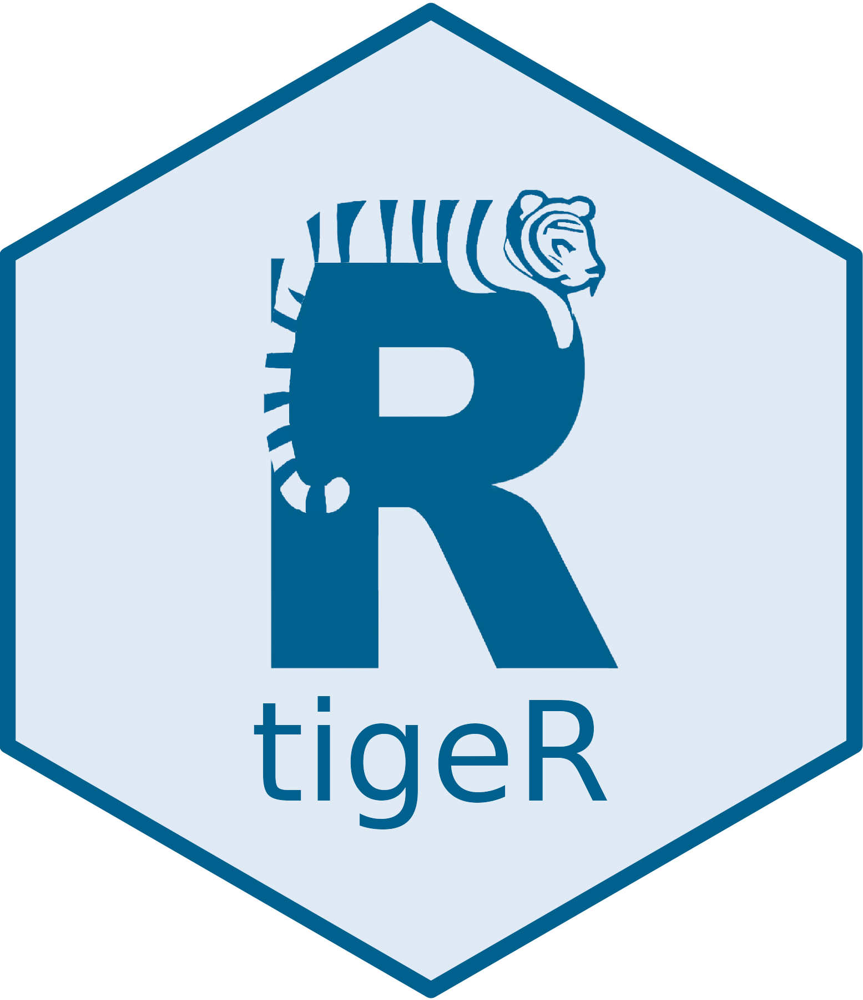

<!-- README.md is generated from README.Rmd. Please edit that file -->

# tigeR 

## Overview

*tigeR* – Training mit individuell generierten Erfolgsrückmeldungen in R
(training with individually generated progress feedback in R) aims to
create a Shiny web application that supports students (in the
introductory statistics class of psychology at Goethe University)
throughout the semester with exercise tasks in statistics and R
programming. The app will provide individualized, automated feedback on
both individual exercises and global competencies, allowing students to
track their learning progress over time. The Shiny app will be designed
to offer a user-friendly interface, making it easy for students to
access exercises, submit their solutions, and receive instant feedback
on their performance. The app will cover a range of topics in statistics
and R, catering to different levels of difficulty and complexity.

## Installation

You can install the development version of shinytigeR from
[GitHub](https://github.com/) with:

``` r
# install.packages("devtools")
devtools::install_github("jlschnatz/shinytigeR")
```

## App Architecture

<embed src="inst/app/www/tigeR_flowchart_horizontal.pdf" width="100%" type="application/pdf" />

## License

Shield: [](http://creativecommons.org/licenses/by-nc-sa/4.0/)

This work is licensed under a [Creative Commons
Attribution-NonCommercial-ShareAlike 4.0 International
License](http://creativecommons.org/licenses/by-nc-sa/4.0/).

[](http://creativecommons.org/licenses/by-nc-sa/4.0/)

<!-- badges: start -->

[](https://lifecycle.r-lib.org/articles/stages.html#experimental)
<!-- badges: end -->
